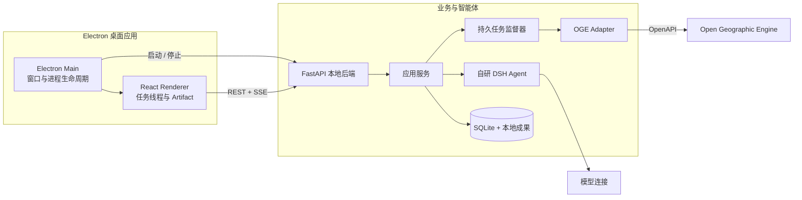

<!-- markdownlint-disable -->

<div align="center">


# 坤舆智枢 Kunyu GeoAgent

面向灾害遥感监测与研判的桌面智能体工作区<br>
让自然语言任务、地理空间计算与可追溯证据在同一线程中闭环

[架构设计](./docs/开发架构设计.md) · [应用方案](./docs/坤舆_灾害监测与研判Agent平台_应用开发方案.md) · [反馈问题](https://github.com/haodijia/kunyu-geoagent/issues)

[](LICENSE)

<br>


<br>


</div>

<!-- markdownlint-restore -->

---

## 项目简介

灾害研判通常需要在有限时间内完成遥感数据发现、空间分析、结果核查和报告整理，流程横跨多种工具，也依赖较强的专业经验。坤舆智枢尝试把这些环节组织成一个面向任务的桌面工作区：用户用自然语言描述目标，智能体结合当前项目、地图选择与 GeoSkill 生成可确认的分析方案，再由确定性业务服务调用 OGE 完成计算。

计算结果不会只停留在一段回答中，而会沉淀为地图、指标、任务详情、核查清单和报告等可版本化成果。每项结论都能回到对应数据、计算任务与空间对象，便于复核、协作和持续更新。

> 项目当前处于设计与开发阶段，首期围绕“榕江县洪涝影响研判”打通一条完整纵向链路。

## 核心设计

- **任务线程即工作区**：一次请求、方案确认、工具执行、OGE 长任务、结果解释与导出都保留在同一线程中。
- **GeoSkill 固化专业方法**：以场景包描述输入、输出、分析步骤、质量规则和展示方式，让灾害研判方法可复用、可验证。
- **人工确认关键参数**：正式计算前明确研究范围、分析时段、数据选择、预期成果和副作用，避免智能体越权执行。
- **Artifact 承载业务成果**：地图、指标、任务、核查清单和报告通过稳定标识关联，不把大段结果塞进聊天消息。
- **证据链贯穿结论**：日期、面积、排名和图斑判断均可定位到成果版本、来源与计算过程；审计轨迹不展示隐藏推理。
- **本地优先、边界清晰**：Electron 管理桌面生命周期，React 负责交互，FastAPI 承载业务与智能体运行，OGE 负责遥感计算。

## 研判闭环

```text
自然语言任务
    ↓
场景识别与数据发现
    ↓
范围 / 时段 / 输出确认
    ↓
OGE 确定性计算
    ↓
地图 / 指标 / 核查清单 / 报告
    ↓
带引用的结论与持续复核
```

首期示例将覆盖“数据接入—信息提取—影响研判—核查反馈—成果更新”全过程：分析榕江县两轮洪水期间的疑似新增积水，统计乡镇与耕地影响，形成重点核查片区，并导出带来源的研判报告。

## 系统架构



系统按 `Project → Thread → Run → Artifact` 组织业务状态：

| 对象 | 作用 |
| --- | --- |
| Project | 保存研究区、事件、数据资产和历史成果 |
| Thread | 承载对话、确认、审计轨迹和成果入口 |
| Run | 表示线程内一次由用户请求触发的智能体运行 |
| Artifact | 表示地图、指标、任务详情、核查清单或报告 |

首版采用 Electron、React、FastAPI、SQLite 与本地成果目录，不引入 Redis、Celery 和 PostgreSQL。OGE 承担遥感计算，自研 DSH 负责模型路由、上下文、GeoSkill、Memory、权限策略与事件记录。

更多进程边界、状态模型、接口与恢复策略请参阅 [开发架构设计](./docs/开发架构设计.md)。

## 计划能力

- 项目与任务线程的创建、恢复、重命名和归档
- 对话、审计轨迹与全幅 GIS 地图之间的无损切换
- 洪涝 GeoSkill、地图上下文和项目记忆
- OGE 数据发现、已发布服务执行、状态追踪与成果读取
- 地图、统计、任务详情、核查清单和 Markdown 报告 Artifact
- 多模型连接与线程级模型、推理强度选择
- FastAPI OpenAPI 文档及与桌面端一致的外部调用能力

## 项目状态

仓库目前以产品方案、交互原型和开发架构为主，运行环境与构建步骤将在首条业务链路落地后补充。当前资料包括：

- [开发架构设计](./docs/开发架构设计.md)：产品状态模型、桌面进程、后端分层、DSH 与 OGE 集成基线
- [应用开发方案](./docs/坤舆_灾害监测与研判Agent平台_应用开发方案.md)：业务目标、场景设计与比赛交付方案
- [OGE OpenAPI 开发者手册](./docs/OGE%20OpenAPI%20开发者手册.md)：平台接口与调用参考
- [界面原型](./docs/ui-mockups/)：对话、地图和模型设置的 v3 视觉基线

欢迎通过 [Issues](https://github.com/haodijia/kunyu-geoagent/issues) 提交建议、场景需求和问题反馈。

## Star History

[](https://star-history.com/#haodijia/kunyu-geoagent&Date)

## 🌟 贡献者

[](https://github.com/haodijia/kunyu-geoagent/graphs/contributors)

感谢所有参与设计、开发、文档完善和问题反馈的贡献者。

## 许可证

本项目基于 [Apache License 2.0](LICENSE) 开源。
