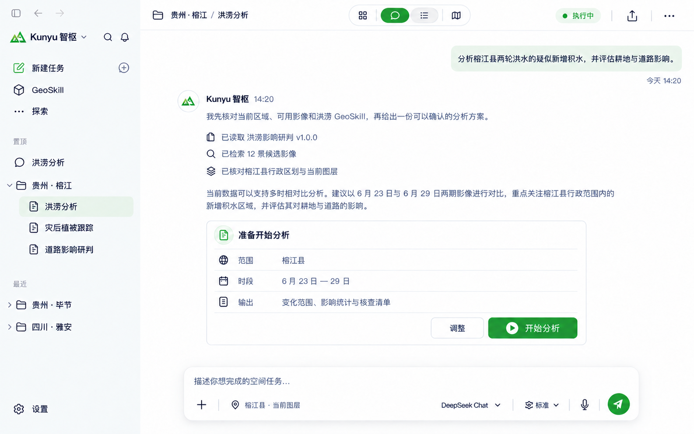
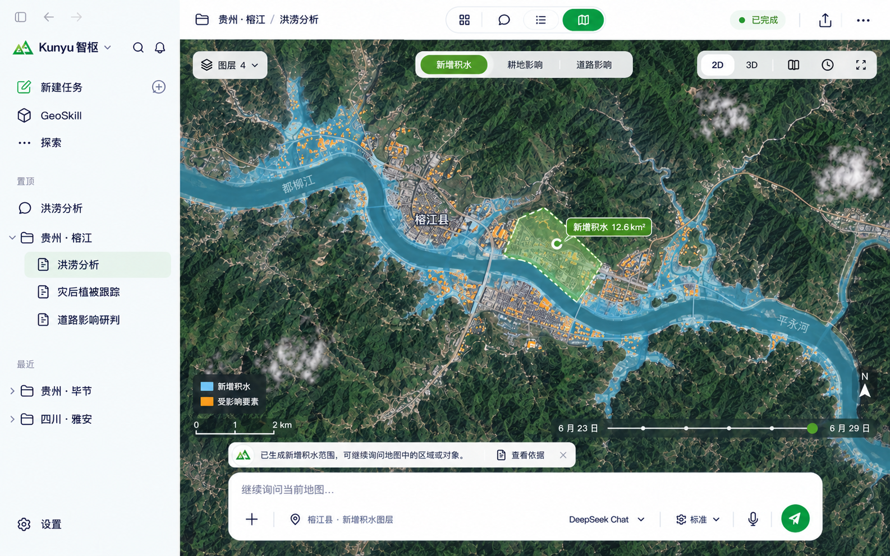

<!-- markdownlint-disable -->

# 坤舆智枢 Kunyu GeoAgent

面向灾害遥感监测与研判的桌面智能体工作区 
基于 OGE 构建

[反馈问题](https://github.com/haodijia/kunyu-geoagent/issues) · [架构设计](./docs/开发架构设计.md)

 

 

<!-- markdownlint-restore -->

---

## 为什么选择坤舆智枢

灾害研判通常需要在有限时间内完成遥感数据发现、空间分析、结果核查和报告整理，流程横跨多种工具，也依赖较强的专业经验。坤舆智枢将自然语言交互、场景方法和 OGE 地理空间计算组织在同一个任务线程中，让复杂的研判过程更容易使用、复核和追溯。

项目目前处于设计与开发阶段，首期围绕“榕江县洪涝影响研判”打通完整业务链路。

## 功能特点

- **任务线程工作区** — 一次请求、方案确认、工具执行、结果解释和成果导出都保留在同一线程中

  

- **地图研判** — 在全幅 GIS 工作区中查看图层、统计结果和空间对象，并将地图选择带回智能体上下文

  

- **可追溯成果** — 将地图、指标、任务详情、核查清单和报告组织为可定位来源与计算过程的业务成果

## 应用场景

- 洪涝、森林火灾、地震与地质灾害等事件的遥感研判
- 灾前背景分析、灾中动态监测与灾后影响评估
- 应急制图、空间信息查询与辅助决策
- 遥感与地理信息教学、演示及科研实验

## Star History

## 🌟 贡献者

## 许可证

[Apache License 2.0](LICENSE)
