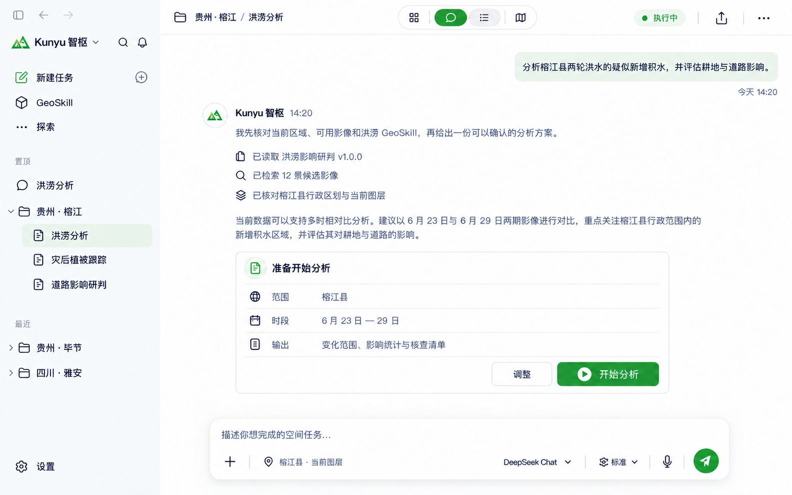
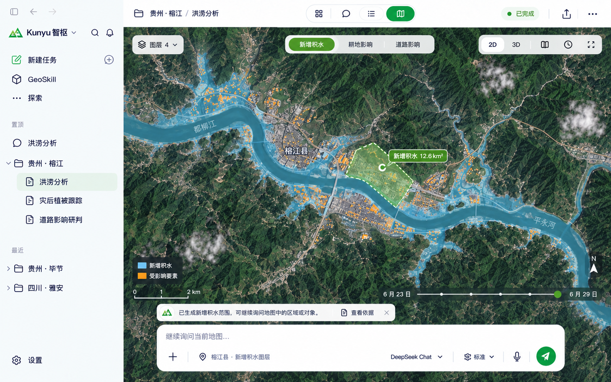

<!-- markdownlint-disable -->

<div align="center">


# 坤舆智枢 Kunyu GeoAgent

面向灾害遥感监测与研判的桌面智能体工作区<br>
基于 OGE 构建

[反馈问题](https://github.com/haodijia/kunyu-geoagent/issues) · [架构设计](./docs/开发架构设计.md)

[](LICENSE)

<br>


<br>


</div>

<!-- markdownlint-restore -->

---

## 为什么选择坤舆智枢

灾害研判通常需要在有限时间内完成遥感数据发现、空间分析、结果核查和报告整理，流程横跨多种工具，也依赖较强的专业经验。坤舆智枢将自然语言交互、场景方法和 OGE 地理空间计算组织在同一个任务会话中，让复杂的研判过程更容易使用、复核和追溯。

项目目前处于设计与开发阶段，首期围绕“榕江县洪涝影响研判”打通完整业务链路。

## 本地开发

首次运行前安装各子工程依赖：

```bash
npm install --prefix electron
npm install --prefix frontend
uv sync --project backend
```

Electron 二进制默认从 npmmirror 下载，避免无法连接 GitHub 时安装失败；镜像地址配置在 `electron/.npmrc`。

在项目根目录用一条命令启动 Vite、Electron 和由 Electron 管理的 FastAPI：

```bash
npm run dev
```

关闭 Electron 窗口或终止该命令时，开发服务会统一退出。

Electron 自动向后端注入随应用安装的 `@vscode/ripgrep` 路径。单独启动后端时显式指定同一二进制，不使用系统 `rg`：

```bash
export KUNYU_RIPGREP_PATH="$(node --input-type=module -e 'import {rgPath} from "./electron/node_modules/@vscode/ripgrep/lib/index.js"; console.log(rgPath)')"
uv run --project backend python -m kunyu.main
```

Agent 系统提示词可直接编辑 [system.md](backend/src/kunyu/agent/prompts/system.md)，下一次模型请求生效。记忆工具及上下文代码入口见[记忆工具与上下文](docs/develop/记忆工具与上下文.md)，目录职责及 Tool、Skill 扩展约定见[后端 Agent 结构](docs/develop/后端Agent结构.md)。

在「设置 → 技能」中新建或导入 `SKILL.md` 技能包。会话中使用 `/技能名` 显式调用，或由模型按任务简介加载；内置 `/disaster-assessment` 灾害研判技能。格式、权限、资源读取和来源优先级见[Agent 技能](docs/develop/Agent技能.md)。

## 功能特点

- **Workspace 与任务会话** — 一次请求、方案确认、工具执行、结果解释和成果导出都保留在同一会话中

  

- **地图研判** — 在全幅 GIS 工作区中查看图层、统计结果和空间对象，并将地图选择带回智能体上下文

  

- **对话附件** — 支持拖拽、粘贴、图片预览、文件下载和带附件的发送队列；图片输入需按模型显式开启，可配置像素预算与请求字节上限，整次超限时持久记录历史图片省略并自动续跑；`read_image` 按路径读取工作区图片、图片文件附件及已省略图片，持久保存工具来源与坐标缩放说明；对话和轨迹的图片结果可直接打开居中预览与缩放弹窗；`read` 按路径、行号读取 UTF-8 附件与工作区文件，对话卡片和轨迹详情显示实际行号与续读位置。
- **原生 Messages** — DeepSeek 默认使用 Messages，保留思考签名和工具结果续接；DeepSeek 与自定义连接可在设置中选择协议。
- **任务进度** — Agent 通过 `todo_write` 更新完整任务计划，对话输入框上方显示当前轮次进度，刷新后可恢复。
- **用户提问** — `ask_user_question` 接管输入区，支持逐题单选、多选、补充文字和跳过；回答草稿随窗口刷新恢复。关闭返回工具取消结果，停止运行取消问题；等待释放执行槽且不计活动预算，回答后继续原工具批次。
- **计划模式** — `/plan [计划需求]` 进入、`/plan off` 退出；输入区显示可点击退出的计划标记。运行中的切换在下一个接受的模型步骤生效，当前工具批次保持原权限；待生效选择随会话日志恢复，退出标记保留输入草稿。
- **工作区文件** — `write` 创建或替换文本文件，`edit` 做精确文本替换；覆盖与编辑校验本会话已读取的文件版本。对话和轨迹展示实际应用的上下文 diff 与增删行数，计划／只读模式禁止写入。
- **文件搜索** — `glob` 查找文件，`grep` 使用 ripgrep 正则定位内容；对话和轨迹显示文件列表与实际匹配行号。超过上限时保存完整结果，Agent 可用 `read` 续读，再读取目标文件并编辑。
- **文件预览** — 文件名、匹配行和 Markdown 文件链接打开侧边多标签面板，支持工作区文本编辑、快捷键保存、行号跳转、Markdown／HTML 可拖动分屏与双向滚动同步、图片缩放及原件下载；增删统计打开该次工具实际提交的历史 diff。标签、面板宽度和未保存修改随会话恢复；保存校验文件版本，冲突保留修改，关闭与刷新前确认未保存内容。附件只读；PDF 支持连续页面、页码跳转、缩放、可选择文字及阅读位置恢复，Office 仍待实现。
- **工作区文件树** — 最右侧按需展开目录，目录优先并按自然名称排序；点击文件打开预览，支持刷新、全部折叠、键盘导航与调整宽度。展开状态和手动开关随工作区保存，原生文件通知自动更新目录；预览内容变化时显示刷新提示，手动刷新读取新内容；窄屏以覆盖面板展示。

- **可追溯成果** — 将地图、指标、任务详情、核查清单和报告组织为可定位来源与计算过程的业务成果

## 应用场景

- 洪涝、森林火灾、地震与地质灾害等事件的遥感研判
- 灾前背景分析、灾中动态监测与灾后影响评估
- 应急制图、空间信息查询与辅助决策
- 遥感与地理信息教学、演示及科研实验

## Star History

[](https://star-history.com/#haodijia/kunyu-geoagent&Date)

## 🌟 贡献者

[](https://github.com/haodijia/kunyu-geoagent/graphs/contributors)

## 许可证

[Apache License 2.0](LICENSE)
