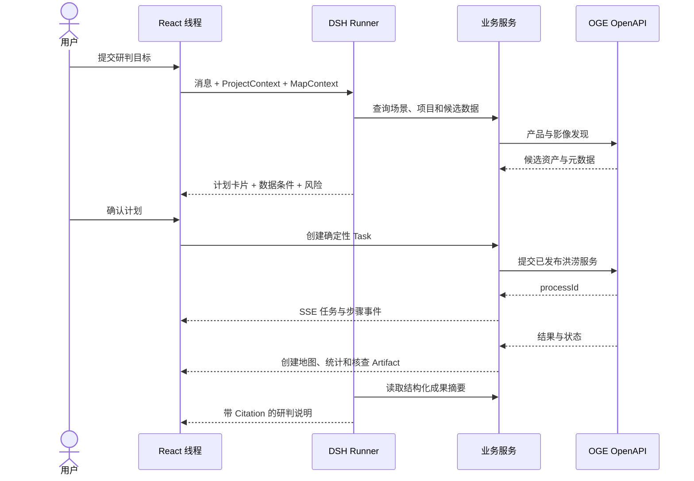
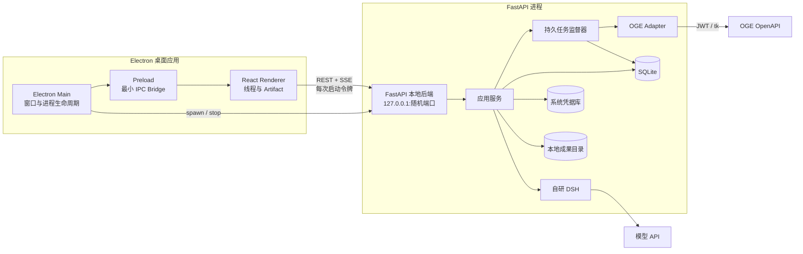
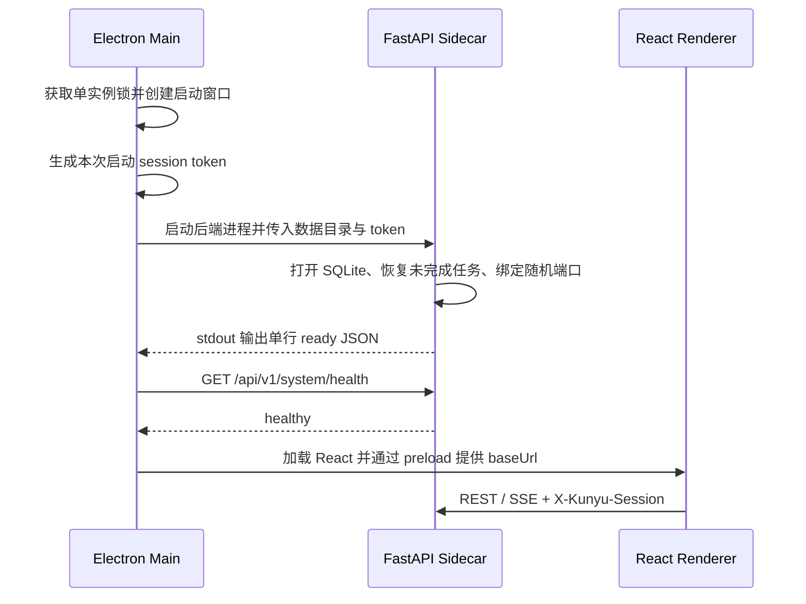
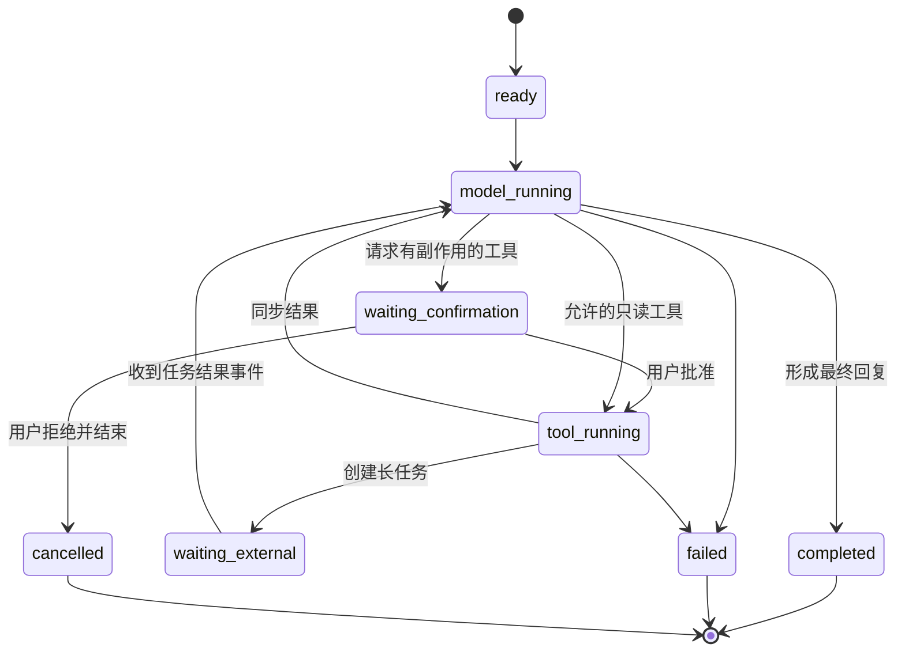
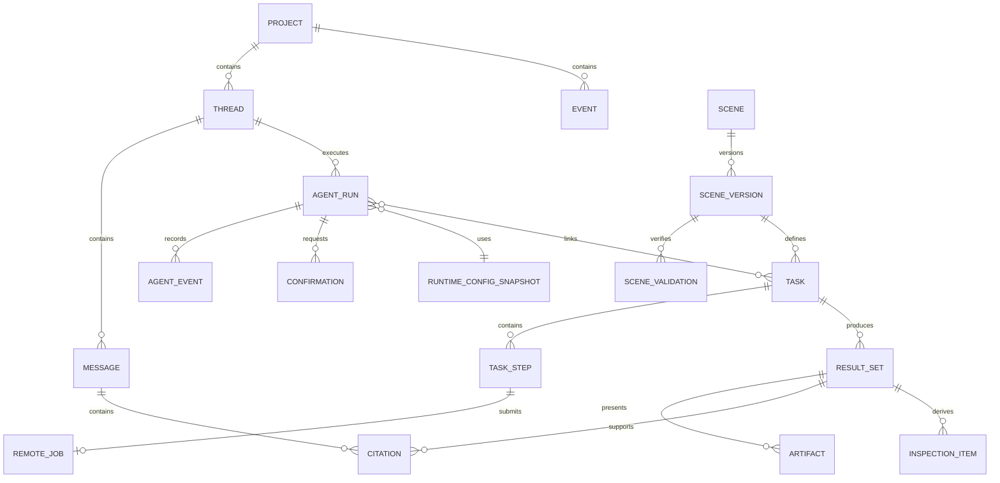

# 坤舆智枢开发架构设计

> 文档状态：新开发基线
> 适用范围：Electron 桌面端、React 前端、FastAPI 后端、自研 DSH Agent 与 OGE 集成
> 当前阶段：已形成任务概览、对话、地图、GeoSkill 与设置页面原型；核心页面职责、对象和进程边界按本文执行，视觉细节仍可迭代。

## 1. 架构决策摘要

本次调整形成以下基线。

1. **Agent 是核心任务工作区。** 产品采用类似 Codex 的布局：左侧管理项目与任务线程，中间承载 Agent 线程，地图、图层、统计、报告等在 Artifact 工作区打开。
2. **以线程组织工作。** 用户进入应用后创建或恢复一个任务线程；一次自然语言请求、计划确认、工具执行、OGE 长任务、结果解释和导出都留在同一线程中。
3. **自研最小 DSH。** DSH 是本项目内部的 Python Agent 框架，参考 DeepSeek Harness 的插件化、能力接缝、类型事件和可恢复会话日志思想，不复制其 TypeScript/Cordis 实现。
4. **仓库顶层固定为 `electron/`、`frontend/`、`backend/`。** Electron 是桌面壳和本地进程管理器，React 只负责界面，FastAPI 承载业务、DSH、OGE 适配和持久任务。
5. **Electron 负责拉起 FastAPI。** 后端仅监听本机回环地址，准备完成后 Electron 才加载 React；退出应用时由 Electron 请求后端优雅停止并回收进程。
6. **首版不引入 Redis、Celery 和 PostgreSQL。** 本地示例采用 FastAPI 单进程、SQLite 和本地成果目录，OGE 承担真正的遥感计算。只有出现并发部署或团队服务化需要时，再拆独立 Worker 和 PostgreSQL/PostGIS。
7. **示例只打通一条纵向链路。** 以“榕江县洪涝影响研判”为唯一完整示例，证明自然语言输入、GeoSkill 约束计划、人工确认、OGE 作业、地图成果和带引用解释能够闭环。
8. **首期不做 Agent 装配页。** DSH 插件和能力由后端启动代码显式装配；业务用户通过 GeoSkill 选择场景方法，通过设置页管理运行连接，不在界面中自由拼装 Agent、Tool 或提示词。

整体设计遵循赛事方案确定的业务目标、OGE 路线、GeoSkill、Memory、证据链和人工确认原则。

## 2. 目标与边界

### 2.1 产品目标

坤舆智枢是面向灾害遥感监测与研判的桌面任务工作区。用户用自然语言描述研判目标，DSH 根据当前项目、地图选择和 GeoSkill 生成可检查的计划；用户确认后，确定性业务服务调用 OGE 完成计算，并把结果作为地图、统计、核查清单和报告 Artifact 返回当前线程。

首期完整链路为：

**新建任务线程 → 描述榕江洪涝研判目标 → 检查并确认计划 → 调用 OGE → 查看地图与统计 Artifact → 复核重点对象 → 导出带来源的研判报告。**

平台仍需响应赛事的五类要求：

- 形成“数据接入—信息提取—影响研判—核查反馈—成果更新”的业务闭环；
- 深度使用 OGE 的数据、算子、在线计算和前序成果引用；
- 提供可复用的 FastAPI WebService；
- 保持 Electron、React、FastAPI、DSH 和 OGE 的模块边界；
- 用任务线程、动态 Artifact 和地图联动体现交互创新。

### 2.2 首期范围

- Electron 桌面启动、单实例、后端进程管理和错误诊断；
- 项目与任务线程创建、恢复、重命名和归档；
- DSH 会话、运行、计划、确认、工具调用、等待和恢复；
- 洪涝 GeoSkill、项目上下文和最小 Memory；
- GeoSkill 目录、版本详情和从场景创建任务；
- 模型、OGE、本地存储、安全与系统状态设置；
- OGE 产品/影像查询、已发布服务执行、状态查询和成果读取；
- 地图、图层、统计、任务详情、引用定位和 Markdown 报告 Artifact；
- 榕江县洪涝影响研判的真实纵向示例；
- FastAPI OpenAPI 文档与同能力的外部调用接口。

### 2.3 首期明确不做

- 通用多 Agent 协作、自治 Agent 群或模型自行创建子 Agent；
- DSH 插件市场、动态下载、热更新或复杂依赖求解；
- Agent 自由装配、角色市场、人格提示词编辑和可视化 Tool 拓扑；
- 在 GUI 中新建、编辑或发布 GeoSkill；首期场景包随源码交付，页面只读；
- 通用可视化工作流编辑器；
- Redis、Celery、Kafka、微服务和多数据库兼容层；
- 多租户计费、复杂组织权限和云端账号体系；
- Agent 直接执行 SQL、任意 Python、Shell 或原始 OGE 请求；
- 移动端、实时多人协作和完整三维场景；
- 同时实现多个灾种的完整业务链。

## 3. 交互架构：Agent 是工作区，不是侧栏

### 3.1 核心界面模型

页面以 `Project → Thread → Run → Artifact` 组织。

- `Project`：一个持续研判空间，保存研究区、事件、资产和历史成果。
- `Thread`：用户可见的工作单元，承载对话、计划、执行过程和成果入口。
- `Run`：线程中一次用户请求触发的 Agent 运行。
- `Artifact`：运行产生或打开的业务对象，例如地图、图层、统计、任务详情和报告。

Agent 线程始终是主工作区的一部分，不作为地图右侧的附属能力。Artifact 是与线程并列的工作面，可打开、关闭、放大或切换。

### 3.2 桌面布局

默认窗口以 `1440 × 900` 为设计基准，最小窗口为 `1180 × 720`。

```text
┌────────────────────────────── 标题栏 / 项目上下文 / 后端状态 ──────────────────────────────┐
├──── 左侧导航 260 px ────┬──────────── Agent 任务线程 ────────────┬──── Artifact 工作区 ────┤
│ 新建任务                 │ 任务标题、场景与运行状态                │ 地图 / 统计 / 报告       │
│ 项目                     │                                      │                         │
│  └ 线程列表              │ 用户目标                              │ 由当前线程产物驱动       │
│ 最近任务                 │ 计划卡片与确认                        │ 可关闭、切换、最大化     │
│ 运行中 / 待确认          │ 工具步骤与结构化结果                  │                         │
│ 设置                     │ 引用化结论                            │ 不放置第二套聊天框       │
│                          │ ───────── 底部输入框 ─────────        │                         │
└──────────────────────────┴──────────────────────────────────────┴─────────────────────────┘
```

布局规则：

- 未打开 Artifact 时，线程居中并使用舒适阅读宽度，右侧不保留空面板。
- 打开地图或报告后进入分屏，线程宽度建议 `520–620px`，Artifact 占剩余空间。
- 地图可一键最大化；最大化时保留悬浮的“返回线程”入口，不常驻聊天侧栏。
- 左侧栏只做导航和状态摘要，不承载复杂业务表单。
- 窗口较窄时 Artifact 覆盖主区域，通过标签返回线程，不把 Agent 压缩成窄栏。

### 3.3 线程中的内容块

线程不是纯消息气泡列表。每条运行可渲染下列结构化块：

| 内容块 | 用途 | 主要操作 |
| --- | --- | --- |
| 用户请求 | 保存原始目标与附带地图上下文 | 编辑并重新运行 |
| 补充问题 | 只询问阻塞执行的必要信息 | 选择、输入、取消 |
| 计划卡片 | 显示区域、时段、输入、步骤、产物和风险 | 修改参数、确认、拒绝 |
| 工具步骤 | 展示查询、提交、等待、完成或失败 | 展开摘要、打开任务 |
| Artifact 卡片 | 表示地图、统计、报告或核查清单 | 在工作区打开 |
| 引用化结论 | 给出结论、观测限制和证据引用 | 点击定位成果或图斑 |
| 后续动作 | 提供复核、导出、基于结果继续分析 | 明确按钮触发 |

模型的内部推理不展示也不持久化。线程只记录用户可理解的计划、操作、工具摘要、错误和结论。

### 3.4 Artifact 工作区

首期只实现五类 Artifact：

1. `map`：OpenLayers 地图、图层树、图例、卷帘和图斑详情；
2. `metrics`：乡镇统计、覆盖率和简单图表；
3. `task`：确定性任务步骤、OGE `processId`、耗时和错误摘要；
4. `inspection-list`：待核查对象、优先级、状态和地图定位；
5. `report`：基于指定成果版本生成的 Markdown 预览与导出。

Artifact 通过稳定标识关联业务对象，而不是把大段数据塞进消息正文：

```ts
interface ArtifactRef {
  artifactId: string
  kind: 'map' | 'metrics' | 'task' | 'inspection-list' | 'report'
  title: string
  resourceType: string
  resourceId: string
  resultSetId?: string
}
```

### 3.5 页面与导航

桌面端采用单窗口、任务优先导航：

| 位置 | 页面/视图 | 说明 |
| --- | --- | --- |
| 启动页 | 最近项目与新建任务 | 启动后第一入口 |
| 线程概览 | 摘要、成果、项目记忆、数据和最近活动 | 快速恢复任务上下文 |
| 线程对话 | 消息、计划、确认和执行步骤 | 发起并推进 Agent Run |
| 线程地图 | 地图 Artifact + 可收起对话 | 浏览成果并把空间选择加入上下文 |
| GeoSkill | 场景目录与版本详情 | 查看输入输出、工作流、质量规则和验证案例 |
| 设置 | 系统状态、模型、OGE、本地存储、安全和关于 | 密钥只交给后端，不进入 React 持久化 |

前端内部可使用 Hash Router，以适配 Electron 打包后的本地资源加载；用户主要通过左侧线程导航，而不是感知复杂 URL。

### 3.6 页面状态与路由

概览、对话和地图不是三种业务对象，而是同一 `ThreadWorkspace` 的三个投影。三者共享当前线程、活动 Run、Artifact、地图选择和输入草稿；切换视图不得重复请求、复制消息或创建新会话。

| 路由 | 页面状态 | 数据来源 |
| --- | --- | --- |
| `#/projects/:projectId/threads/:threadId/overview` | 线程概览 | Thread 聚合查询 |
| `#/projects/:projectId/threads/:threadId/chat` | 完整对话 | Message、Run、Confirmation、ArtifactRef |
| `#/projects/:projectId/threads/:threadId/map` | 地图 Artifact | Artifact、ResultSet、MapContext |
| `#/geoskills` | GeoSkill 目录 | SceneVersion 摘要 |
| `#/geoskills/:sceneId/:version` | GeoSkill 版本详情 | 已发布场景包投影 |
| `#/settings/:section` | 设置分区 | Settings 与 SystemStatus |

地图页的对话采用 `expanded | composer | fab` 三种本地显示状态。它们只改变面板高度和内容显隐，地图视口、选中图斑、输入草稿和线程订阅保持不变。首次进入地图使用 `composer`；Run 等待用户确认或失败时自动提升为 `expanded`，普通进度不得抢占用户当前视图。

### 3.7 GeoSkill 页面

GeoSkill 页面负责回答“系统会做什么、需要什么、会产出什么”，不是提示词仓库或 Agent 插件市场。

首期目录页实现：

- 按名称、灾种和状态筛选已随应用交付的 GeoSkill；
- 查看版本、能力标签、输入输出、工作流、质量规则、展示配置和验证案例；
- 从指定 `SceneVersion` 创建任务，创建后的 Task 永久锁定该版本；
- 展示场景包校验结果和 OGE 能力依赖是否满足；
- 不允许在 GUI 中直接编辑 YAML、Markdown 或发布新版本。

`geoskill-editor-v2.png` 是后续管理能力的目标稿。只有首条洪涝链路稳定后才实现草稿、Schema 校验、验证案例和发布；编辑器采用结构化表单和有序步骤，不做自由连线画布。场景发布属于人工管理操作，不开放给 Agent Tool。

### 3.8 设置页面

设置页分为五个分区：

| 分区 | 可配置内容 | 写入位置 |
| --- | --- | --- |
| 模型服务 | Provider 类型、Base URL、模型 ID、写入型 API Key 字段、连接测试 | 非秘密配置写 SQLite，密钥写系统凭据库 |
| OGE 连接 | Base URL、鉴权 Profile、AppKey/JWT 配置状态、连接测试 | 非秘密配置写 SQLite，凭据写系统凭据库 |
| 本地存储 | 数据目录、占用空间、导出目录和清理入口 | SQLite + 应用数据目录 |
| 隐私与安全 | 日志级别、脱敏说明、凭据状态和数据清理 | SQLite；不显示密钥原文 |
| 关于 | 应用、API、DSH 和场景包版本 | 构建信息与后端状态 |

密钥输入框是写入控件，不是可读取字段。前端只能获得 `configured`、更新时间和可选尾号，不能通过 API 取回明文。连接测试由 FastAPI 发起并返回类别化结果；React 不直连模型或 OGE。

### 3.9 为什么没有 Agent 装配页

首期只有一个受控 `GeoAgent` 运行角色。其模型、上下文、Tool、GeoSkill、Memory、Policy 和 EventStore 在 `kunyu.agent.bootstrap` 中显式装配，属于可测试、可审计的系统启动配置。

```text
GeoAgent（固定运行角色）
├── Model Provider       ← 设置页选择连接
├── Context Provider     ← 项目、线程、地图与成果
├── Tool Registry        ← 后端代码注册白名单 Tool
├── GeoSkill Resolver    ← 任务锁定已发布 SceneVersion
├── Memory Provider      ← Thread / Project / Case Memory
├── Policy Gate          ← 副作用、确认、预算与权限
└── Event Store          ← SQLite 追加事件
```

独立装配页会要求动态插件发现、依赖求解、权限编辑、配置 Schema、运行隔离和兼容性验证，这与“自研最小 DSH”和单一洪涝纵向示例相冲突。以后若确有多角色需求，只新增由代码定义的 `AgentProfile` 下拉选择，并把 `profile_id` 快照到 Run；仍不允许用户任意拼装插件。

### 3.10 原型与实现映射

| 原型 | 对应实现重点 |
| --- | --- |
| [`session-overview-v2.png`](ui-mockups/session-overview-v2.png) | Thread 聚合查询、成果卡片、项目记忆与最近事件投影 |
| [`session-chat-v2.png`](ui-mockups/session-chat-v2.png) | Message/Run 渲染、计划卡片、步骤和输入上下文 |
| [`session-map-v2.png`](ui-mockups/session-map-v2.png) | Map Artifact、时相、图层和空间引用 |
| [`map-chat-states-v2.png`](ui-mockups/map-chat-states-v2.png) | 同一对话的三种本地显示态 |
| [`geoskill-library-v2.png`](ui-mockups/geoskill-library-v2.png) | SceneVersion 目录、详情和创建任务入口 |
| [`settings-model-v2.png`](ui-mockups/settings-model-v2.png) | 脱敏设置、连接测试与系统状态 |
| [`geoskill-editor-v2.png`](ui-mockups/geoskill-editor-v2.png) | 后续 SceneVersion 草稿、验证与发布，不属于首期 |

## 4. 首个示例：榕江洪涝研判线程

现有 `docs/ui-mockups/` 已覆盖概览、对话、地图、GeoSkill 与设置。首版仍以一条可验收的纵向示例确定组件，不因页面齐全而提前铺开多灾种业务。

### 4.1 示例入口

启动页提供一个主按钮“新建研判任务”和一个示例提示：

> 分析榕江县 2025 年 6 月两轮洪水期间的疑似新增积水，统计乡镇耕地影响，并列出重点核查片区。

用户可直接采用该提示，也可修改区域、时间和目标。创建后进入名为“榕江洪涝影响研判”的线程。

### 4.2 示例运行



### 4.3 示例页面状态

示例只需覆盖下列状态：

1. **空线程**：显示可使用的场景和一条示例目标；
2. **规划中**：流式展示简短状态，不展示模型思维链；
3. **待确认**：线程内出现计划卡片，提交按钮明确说明会创建 OGE 任务；
4. **执行中**：计划卡片变为步骤时间线，任务 Artifact 自动打开；
5. **等待 OGE**：线程可继续浏览，关闭窗口后再次启动仍能恢复；
6. **完成**：地图 Artifact 自动打开，线程输出带引用结论；
7. **观测不足**：不生成确定性灾情结论，显示缺失数据和建议；
8. **失败**：展示错误类别、已完成步骤和可执行的重试入口。

### 4.4 示例验收结果

- 用户不接触 OGE URL、AppKey、原始请求或内部文件路径；
- 计划中能看到榕江县范围、四个时间窗口、数据选择和预期成果；
- 正式计算必须经过确认；
- OGE `processId` 可在任务 Artifact 中追踪；
- 地图、统计、核查清单和报告引用同一个 `ResultSet`；
- Agent 回答中的日期、面积、排名和图斑判断可点击定位到证据；
- 应用重启后线程、任务和 Artifact 可恢复。

## 5. 进程与系统架构

### 5.1 桌面运行架构



进程职责：

| 进程 | 负责 | 不负责 |
| --- | --- | --- |
| Electron Main | 单实例、窗口、FastAPI 子进程、系统菜单、文件选择、更新和崩溃诊断 | 不包含业务规则，不直接访问 OGE |
| React Renderer | 线程、Artifact、地图、确认和状态展示 | 不拥有密钥，不使用 Node API，不决定任务最终状态 |
| FastAPI | 业务对象、DSH、策略、任务、持久化、OGE 与模型接入 | 不承担 Electron 窗口逻辑 |
| OGE | 遥感数据、算子、组合模型与在线计算 | 不管理本地项目线程和人工确认 |

系统凭据库是 FastAPI 的基础设施依赖，只保存模型与 OGE 密钥。SQLite 保存可公开展示的连接参数和 `configured` 状态，React 只通过脱敏设置 API 访问。

### 5.2 服务化部署边界

FastAPI 必须保持可独立启动和提供 OpenAPI 文档，因此桌面端不是唯一入口。赛事需要的 WebService 与桌面端复用相同应用服务和请求模型。

首版只交付本地单进程实现。需要多人访问或持续后台计算时，再形成服务器部署版本：独立 API、Worker、PostgreSQL/PostGIS 与任务队列。该扩展不得改变 `Thread`、`Run`、`Task`、`Artifact` 和 OGE Adapter 的公开契约，但首版不提前实现双存储和双队列兼容代码。

## 6. 仓库结构

仓库按以下顶层结构建设：

```text
kunyu-geoagent/
├── electron/
│   ├── package.json
│   ├── src/
│   │   ├── main/              # 窗口、单实例、FastAPI 进程和应用生命周期
│   │   └── preload/           # 受控 IPC：启动信息、文件对话框、系统能力
│   ├── resources/             # 图标与打包资源
│   └── scripts/               # 后端 sidecar 打包与桌面构建脚本
├── frontend/
│   ├── package.json
│   ├── src/
│   │   ├── app/               # 路由、Provider、错误边界和主题
│   │   ├── pages/             # 启动页、项目、线程、场景库和设置
│   │   ├── features/
│   │   │   ├── threads/       # 消息、运行、计划和确认
│   │   │   ├── artifacts/     # Artifact 容器、标签与分屏
│   │   │   ├── map/           # OpenLayers、图层、绘制和引用定位
│   │   │   ├── tasks/         # 步骤状态和 OGE 作业详情
│   │   │   ├── geoskills/     # 场景目录、版本详情和创建任务
│   │   │   ├── settings/      # 连接、存储、安全和系统状态
│   │   │   ├── inspections/   # 核查清单和反馈
│   │   │   └── reports/       # 报告预览与导出
│   │   ├── entities/          # Thread、Run、Task、Artifact 等前端类型
│   │   └── shared/            # API、SSE、UI、hooks 和 utils
│   └── vite.config.ts
├── backend/
│   ├── pyproject.toml
│   ├── uv.lock
│   ├── src/
│   │   ├── dsh/               # 业务无关的最小 Agent 框架
│   │   │   ├── contracts.py
│   │   │   ├── events.py
│   │   │   ├── host.py
│   │   │   ├── runner.py
│   │   │   ├── reducer.py
│   │   │   └── errors.py
│   │   └── kunyu/
│   │       ├── api/           # FastAPI 路由、依赖和 SSE
│   │       ├── application/   # 用例编排与事务边界
│   │       ├── domain/        # 项目、线程、任务、成果和规则
│   │       ├── agent/         # DSH 插件装配、策略与 GeoAgent 行为
│   │       ├── scenes/        # GeoSkill 发现、加载和校验
│   │       ├── settings/      # 非秘密配置、系统状态与连接测试
│   │       ├── integrations/
│   │       │   ├── oge/       # OGE 鉴权、协议和结果适配
│   │       │   └── model/     # 模型适配
│   │       ├── secrets/       # 系统凭据库存取；只返回配置状态
│   │       ├── jobs/          # 持久任务监督、轮询与恢复
│   │       ├── persistence/   # SQLite 仓储与迁移
│   │       ├── reports/       # Markdown 报告
│   │       └── main.py        # FastAPI 组装入口
│   ├── scenarios/
│   │   └── flood-assessment/  # 洪涝 GeoSkill 场景包
│   └── var/                   # 开发期数据库、日志与成果，禁止提交业务数据
├── oge-scripts/
│   └── flood/                 # 在 OGE 侧开发和发布的洪涝脚本
├── docs/
├── assets/
└── README.md
```

约束：

- Electron、frontend 和 backend 分别拥有依赖清单，不在根目录混放源码；
- Python 环境统一由 `uv` 管理；
- `dsh` 不依赖 `kunyu`，`kunyu.agent` 可以依赖并装配 `dsh`；
- OGE 脚本与本地后端代码分开，后端通过发布后的 OpenAPI 服务调用；
- 场景差异进入 `backend/scenarios/`，不在 DSH Runner 中写洪涝条件分支；
- React 的 GeoSkill 页面读取场景投影，不直接读取或修改 `backend/scenarios/` 文件；
- 模型和 OGE 密钥通过 Python 系统凭据库适配器保存，不写入 SQLite、环境配置文件或场景包。

## 7. Electron 启动与安全设计

### 7.1 启动流程



开发环境启动命令由 Electron 执行：

```text
uv run --project backend python -m kunyu.main --desktop
```

发布包中使用同一后端源码构建 sidecar，可执行文件路径由打包资源确定。Renderer 不自行寻找端口，也不尝试连接系统中其他 FastAPI 实例。

### 7.2 Ready 协议

后端成功启动后只向标准输出写一条机器可读事件：

```json
{"type":"ready","host":"127.0.0.1","port":43127,"pid":8123,"api_version":"1"}
```

Electron 在收到 Ready 且健康检查通过前不加载业务界面。超时、进程退出或协议不匹配时显示诊断页，包含退出码、脱敏后的最近日志和“重新启动后端”按钮。

### 7.3 关闭与恢复

- Electron 退出前调用后端内部 shutdown 接口；
- 后端停止接收新 Run，持久化当前事件和任务检查点；
- Electron 等待有限时间后结束自己创建的子进程；
- 已提交 OGE 的远端任务不视为取消，下一次启动根据 `processId` 恢复查询；
- 不允许两个桌面实例同时写同一 SQLite 文件。

### 7.4 安全边界

- FastAPI 仅绑定 `127.0.0.1` 的随机端口；
- Electron 每次启动生成随机 session token，通过环境变量交给后端，通过 preload 交给 Renderer 内存；
- 所有 API 和 SSE 请求携带 `X-Kunyu-Session`，token 不写入 URL、本地存储和普通日志；
- Electron 开启 `contextIsolation`，关闭 Renderer 的 Node 集成；
- preload 只暴露后端启动信息、文件选择和少量系统能力；
- OGE JWT、AppKey 和模型密钥只由 FastAPI 读写系统凭据库；设置查询只返回是否已配置，不返回明文；
- 外部链接交给系统浏览器，React 不直接导航到不可信页面。

## 8. 前端设计

### 8.1 技术基线

- React + TypeScript + Vite；
- TanStack Query 管理服务端状态；
- Zustand 管理当前窗口、分屏、选中 Artifact 和地图交互状态；
- OpenLayers 渲染二维地图；
- ECharts 渲染统计图；
- 原生 `EventSource` 无法附加自定义 session header，因此 SSE 客户端使用 `fetch` 流读取；
- 首期不引入 Cesium，三维作为主链完成后的独立 Artifact 类型。

### 8.2 状态边界

| 状态 | 事实来源 | 示例 |
| --- | --- | --- |
| 服务端状态 | FastAPI | 项目、线程、Run、Task、Artifact、成果 |
| 本地界面状态 | Zustand | 侧栏宽度、分屏、活动 Artifact、地图视口 |
| 表单草稿 | 组件本地状态 | 计划中的可编辑时间和阈值 |
| 流式临时状态 | SSE 客户端 | 当前消息增量、步骤动画 |

SSE 增量只是展示状态。收到完成事件或重连后，前端重新读取对应资源，不用本地事件推导永久业务状态。

### 8.3 地图上下文

用户发消息时只提交明确选择，不把完整地图对象序列化给 Agent：

```ts
interface MapContext {
  projectId: string
  eventId: string | null
  viewport: { longitude: number; latitude: number; zoom: number }
  selectedAoiId: string | null
  selectedFeature: { layerId: string; featureId: string } | null
  activeObservationId: string | null
  visibleLayerIds: string[]
}
```

“这里”“这个图斑”“上一期”必须由这些稳定引用解析。无法唯一解析时，DSH 生成补充问题，不猜测对象。

### 8.4 页面查询与本地状态

前端按页面建立查询边界：

| 页面 | 主查询 | 只保存在本地的状态 |
| --- | --- | --- |
| 线程概览 | `thread workspace` 聚合数据 | 卡片折叠状态 |
| 线程对话 | Message、Run、Confirmation、ArtifactRef | 输入草稿、滚动锚点 |
| 线程地图 | Artifact、ResultSet、Layer、Citation | 视口、图层显隐、对话显示态 |
| GeoSkill | SceneVersion 列表与详情 | 搜索词、选中标签页 |
| 设置 | 脱敏后的 Settings、SystemStatus | 未提交表单草稿 |

线程顶部的概览/对话/地图切换使用路由，地图内部的 `expanded/composer/fab` 使用 Zustand。切换页面时取消页面级临时请求，但不取消服务端 Run 或 Task。设置保存成功后使对应 Query 失效并重新读取脱敏值。

### 8.5 GeoSkill 展示模型

前端不解析 `SKILL.md` 或 YAML。后端把已校验场景包投影为稳定 DTO：

```ts
interface SceneVersionDetail {
  sceneId: string
  version: string
  title: string
  status: 'published' | 'disabled'
  summary: string
  capabilities: string[]
  inputs: SceneField[]
  outputs: SceneField[]
  workflow: SceneStep[]
  qualityRules: QualityRuleSummary[]
  presentation: PresentationSummary
  validation: ValidationSummary
}
```

首期不把 `draft` 和 `validating` 暴露为可编辑状态；原型中的状态用于后续发布流程。若场景依赖的 OGE 服务或模型连接不可用，详情页显示阻塞原因并禁用“创建任务”。

## 9. FastAPI 业务架构

### 9.1 分层与依赖

依赖方向固定为：

```text
api → application → domain
                    ↑
agent / jobs / integrations / persistence 实现 domain 定义的接口
```

业务模块：

| 模块 | 核心对象 | 职责 |
| --- | --- | --- |
| Projects | Project、Event、AOI | 项目、事件和空间范围 |
| Threads | Thread、Message、Run | 用户任务线程和 Agent 运行 |
| Scenes | SceneVersion、Skill | 场景发现、版本与约束 |
| Settings | RuntimeSettings、CredentialRef、ConnectionCheck | 脱敏配置、系统凭据库和连接诊断 |
| Tasks | Task、TaskStep、RemoteJob | 确定性任务和 OGE 状态 |
| Results | ResultSet、Layer、Metric | 成果版本与结构化事实 |
| Artifacts | Artifact | 可在前端工作区打开的视图 |
| Inspections | InspectionItem、Feedback | 核查对象和人工反馈 |
| Reports | Report | 从指定成果版本生成报告 |
| Memory | MemoryEntry | 项目设置与经确认的案例摘要 |

### 9.2 线程、运行与任务的区别

- `Thread` 是用户持续工作的容器；
- `Run` 是一次 Agent 循环，可完成、失败、等待确认或等待外部任务；
- `Task` 是确定性业务工作流，不依赖模型存活；
- 一个 Run 可以查询多个对象，但只有确认后才能创建正式 Task；
- Run 等待 OGE 时保存检查点并结束当前执行占用，由任务事件触发恢复。

### 9.3 本地持久化

首期 SQLite 使用 WAL 模式，保存结构化元数据和追加式事件；大文件存入应用数据目录。

```text
<app-data>/
├── kunyu.db
├── artifacts/<artifact-id>/
├── results/<result-set-id>/
├── exports/
└── logs/
```

数据库不保存大型 GeoTIFF、PNG 或报告文件内容，只保存路径、类型、大小、空间参考、版本和来源。几何首期保存为 GeoJSON/WKB 与范围字段；复杂空间运算继续由 OGE 完成。

非秘密运行设置按命名字段保存到 SQLite，并带 `updated_at`。密钥只以固定服务名和账号名写入操作系统凭据库；数据库最多保存 `CredentialRef` 的类型、是否配置和更新时间。Run 创建时保存所用模型配置快照，Task 创建时保存 OGE Profile 与 SceneVersion 快照，后续修改设置不改变已运行记录。

## 10. 自研最小 DSH

### 10.1 定位

`dsh` 是业务无关的最小 Agent Harness。它只解决五件事：

1. 安装和管理插件；
2. 注册并解析能力；
3. 以类型事件记录会话事实；
4. 推进模型—工具循环；
5. 在确认、外部任务或失败处暂停并恢复。

项目、地图、OGE、GeoSkill 和报告均属于 `kunyu` 插件或业务服务，不进入 DSH 核心。

### 10.2 从 DeepSeek Harness 借鉴与不借鉴的内容

| 借鉴 | 本项目实现方式 |
| --- | --- |
| everything is a plugin | 模型、工具、上下文、Skill、Memory、策略和事件存储通过能力接口装配 |
| capability seams | 插件只依赖声明的 Protocol，不互相导入具体实现 |
| typed events | Pydantic 判别联合定义事件，SQLite 追加保存 |
| recoverable session log | Reducer 从事件重建 RunState，等待任务后可恢复 |
| lifecycle | `install → start → stop`，按显式顺序装配和逆序关闭 |

首期不实现 Cordis、动态 npm 插件、热重载、远程插件市场、复杂扩展点继承和通用多 Agent 调度。

### 10.3 核心契约

```python
class Plugin(Protocol):
    manifest: PluginManifest

    def install(self, host: Host) -> None: ...
    async def start(self) -> None: ...
    async def stop(self) -> None: ...


class Host(Protocol):
    def provide(self, key: CapabilityKey[T], value: T) -> None: ...
    def require(self, key: CapabilityKey[T]) -> T: ...
    async def emit(self, event: AgentEvent) -> None: ...


class Tool(Protocol):
    spec: ToolSpec

    async def invoke(self, context: ToolContext, arguments: BaseModel) -> ToolResult: ...
```

实现约束：

- 插件列表在 `kunyu.agent.bootstrap` 中显式声明，不扫描任意目录；
- 每个能力键只能有一个默认提供者，重复注册立即启动失败；
- Manifest 只包含 `id`、`version`、`requires`、`provides` 和配置 Schema；
- DSH 使用 Protocol 和 Pydantic，不依赖 FastAPI、SQLAlchemy、OGE SDK 或前端类型；
- 插件启动失败时整体启动失败，不静默降级为其他实现；
- 设置页只能修改已装配 Provider 的运行参数，不能增删插件、改变 Capability 依赖或绕过 PolicyGate；
- 模型设置在新 Run 开始时读取并形成快照，进行中的 Run 不热切换 Provider 或模型。

### 10.4 首期插件

| 插件 | 提供能力 |
| --- | --- |
| `event_store.sqlite` | 追加事件、按线程读取事件 |
| `model.openai_compatible` | 流式模型响应与 Tool Call |
| `context.kunyu` | 项目、地图、Skill、Memory 和运行摘要 |
| `tools.kunyu` | 业务 Tool Registry |
| `skills.geo` | GeoSkill 查找与版本加载 |
| `memory.project` | 项目记忆查询和候选写入 |
| `policy.kunyu` | 权限、副作用、预算和确认门禁 |

这些插件由团队实现并随源码交付。OGE 不作为模型插件直接挂载；它只能通过 `tools.kunyu` 调用应用服务。

### 10.5 类型事件

所有可恢复状态来自追加式事件：

```json
{
  "event_id": "evt_01",
  "thread_id": "thr_01",
  "run_id": "run_01",
  "sequence": 12,
  "type": "tool.completed",
  "occurred_at": "2026-09-20T08:00:00Z",
  "payload": {}
}
```

首期事件集合：

- `thread.created`
- `message.user.appended`
- `message.assistant.delta`
- `message.assistant.completed`
- `plan.proposed`
- `confirmation.requested`
- `confirmation.resolved`
- `tool.requested`
- `tool.started`
- `tool.completed`
- `tool.failed`
- `run.waiting_external`
- `run.resumed`
- `artifact.published`
- `run.completed`
- `run.failed`
- `run.cancelled`

事件中不保存模型隐藏推理；工具输入只保存校验后的结构化参数和脱敏摘要。

### 10.6 Run 状态机



Runner 的最小循环：

1. 追加用户消息；
2. Reducer 重建当前 RunState；
3. Context 插件按预算组装上下文；
4. 模型返回文本增量、Tool Call 或最终回复；
5. Tool Call 先经 Schema 校验和 PolicyGate；
6. 需确认则写事件并暂停；只读工具直接执行；
7. 长任务返回 `task_id` 后写等待事件并释放运行；
8. 任务完成事件恢复 Run，读取成果摘要；
9. 写最终消息和完成事件。

每次 Run 限制模型轮次、工具次数、墙钟时间和模型用量。达到限制后返回可解释的失败状态，不进行无限循环。

### 10.7 装配方式

最小 DSH 采用一个代码入口完成确定性装配：

```python
def build_geo_agent(settings: RuntimeSettings) -> AgentRuntime:
    return AgentRuntime(
        event_store=SqliteEventStore(...),
        model=OpenAICompatibleModel(settings.model),
        context=KunyuContextProvider(...),
        tools=KunyuToolRegistry(...),
        skills=GeoSkillResolver(...),
        memory=ProjectMemoryProvider(...),
        policy=KunyuPolicyGate(...),
    )
```

该入口是系统 Composition Root，也是赛事展示“自研 Harness 如何组装能力”的直接证据。首期不建立 `AgentDefinition` 数据表，不把插件列表序列化到数据库，也不提供对应 CRUD API。设置页修改的是 `RuntimeSettings`，GeoSkill 页面管理的是 `SceneVersion`，二者都不等于 Agent 装配。

## 11. GeoSkill、Tool 与 Memory

### 11.1 GeoSkill

GeoSkill 是版本化场景契约，不是散装提示词：

```text
backend/scenarios/flood-assessment/
├── manifest.yaml
├── SKILL.md
├── workflow.yaml
├── validation.yaml
├── presentation.yaml
├── references/
└── examples/
```

- `manifest.yaml`：场景 ID、版本、输入输出、工具和算法能力依赖；
- `SKILL.md`：数据选择、处理策略、质量限制和解释规则；
- `workflow.yaml`：确定性步骤、依赖、条件分支和参数映射；
- `validation.yaml`：输入、观测覆盖和成果完整性规则；
- `presentation.yaml`：计划字段、图层样式、统计列和报告字段。

发布后不可原地修改；任务锁定场景版本与具体 OGE 服务绑定。

场景包启动加载流程固定为：发现内置目录 → 校验文件和 Schema → 解析能力依赖 → 检查 OGE 服务绑定 → 生成只读页面投影 → 登记可用版本。任何一步失败都将该版本标为不可用并记录明确原因，不以缺字段默认值继续运行。

GeoSkill 页面与 DSH 的关系是“选择契约”，不是“装配运行时”：

1. 用户查看已发布 SceneVersion 并创建线程；
2. Thread 保存默认 `scene_version_id`，用户可在正式 Task 创建前更换；
3. DSH Context Provider 读取该版本的精简约束，辅助形成计划；
4. `workflow.preview` 按 Schema 生成确定性计划快照；
5. 用户确认后，`workflow.submit` 由应用服务创建 Task 并锁定版本；
6. 后续 Run 只能读取 Task 已锁定的场景版本，不能通过对话篡改。

后续 GeoSkill 编辑器若实现，发布过程必须新建版本、完成 Schema 校验和至少一个验证案例，再原子地将版本标为 `published`。已发布目录不可直接覆盖。

### 11.2 Tool

首期工具保持精简：

```text
project.get_context
scene.get
data.search_observations
data.describe_observation
workflow.preview
workflow.submit
task.get
result.get_summary
result.query_features
inspection.update
report.create
```

副作用分级：

| 等级 | 类型 | 示例 | 策略 |
| --- | --- | --- | --- |
| L0 | 本地读取 | 项目、场景、已有成果 | 自动执行 |
| L1 | 外部只读 | OGE 产品、影像、任务状态 | 自动执行并记录 |
| L2 | 创建或修改 | 提交 OGE 任务、保存核查、生成报告 | 每次明确确认 |
| L3 | 删除或发布 | 删除成果、发布场景、修改凭证 | 不向首期 Agent 开放 |

Tool 只能调用应用服务。模型不能提交 URL、SQL、Python 代码、服务器路径或 OGE 原始请求。

### 11.3 Memory

首期只实现三层：

| 类型 | 内容 | 写入规则 |
| --- | --- | --- |
| Thread Summary | 当前目标、已确认选择、等待事项 | 每次 Run 完成后生成并保存来源 |
| Project Memory | 常用区域、资产、关注对象和报告设置 | 用户明确保存或确定性业务操作产生 |
| Case Memory | 已完成任务、质量和人工复核摘要 | 从正式成果和核查记录生成 |

方法知识保存在版本化 GeoSkill 中，不额外建设向量知识库。首版按项目、场景、类型、时间和关键词检索 SQLite 记录。

## 12. OGE 集成

### 12.1 两条开发链路

OGE 文档体现两种不同链路，架构中必须分开：

1. **算法开发链路**：遥感人员在 OGE 开发环境用 `Service.getCoverage`、`getCoverageCollection`、`getProcess(...).execute(...)`、样式和导出能力开发脚本，并发布为 OpenAPI 算子或组合模型。
2. **应用调用链路**：本地 FastAPI 只调用已发布 OpenAPI，管理鉴权、参数映射、异步 `processId`、结果读取和业务成果登记。

React 和 DSH 都不直接运行 OGE Python 脚本。

### 12.2 鉴权

OGE 存在双轨凭证：

- JWT：登录、上传、资产列表、产品/影像、算子定义、结果和下载；
- AppKey `tk`：调用 `/openapi/**` 已发布服务；部分 OpenAPI 状态查询场景也可能要求 `tk`。

手册不同位置对登录密码处理和状态查询凭证存在表述差异，不能把未经联调的假设写死。`OGEAuthProfile` 按实际环境记录登录请求形式、状态查询鉴权和网关前缀；联调结果作为配置与接入文档的一部分。

### 12.3 输入引用

适配层支持手册定义的引用并保存原始引用类型：

- `Personal:MyData:myData/{文件名}`
- `Personal:Asset:{assetUuid}`
- `Personal:Process:{processId}`
- `Platform:Coverage:{imageIdentification}:{productName}`
- `Platform:Product:Coverage:{productName}:{imageIds}`
- `Platform:Product:{productName}`

前序 OGE 结果优先使用 `Personal:Process:{processId}` 在平台内部衔接，避免无意义的下载再上传。

### 12.4 OGE Adapter

```python
class OGEClient(Protocol):
    async def list_products(self, query: ProductQuery) -> list[Product]: ...
    async def list_images(self, product_id: str) -> list[Observation]: ...
    async def describe_process(self, name: str) -> ProcessDefinition: ...
    async def submit_algorithm(self, request: AlgorithmRequest) -> RemoteJob: ...
    async def submit_combination(self, request: CombinationRequest) -> RemoteJob: ...
    async def get_job(self, process_id: str) -> RemoteJobStatus: ...
    async def get_result(self, process_id: str) -> RemoteResult: ...
    async def download_result(self, process_id: str, target: Path) -> DownloadedAsset: ...
```

适配层统一处理：

- Base URL、网关前缀、JWT 刷新和 `tk` 注入；
- OGE `code/msg/data` 与 HTTP 状态的双重校验；
- `resultStatus` 和引擎状态到内部状态的映射；
- 输出文件名唯一性；
- 限流、超时、可重试错误和脱敏日志；
- `processId`、输入引用、算法版本与内部步骤关联；
- TIFF、GeoJSON、JSON、COG 预览和下载结果的校验。

### 12.5 持久任务监督器

首期不用 Celery。FastAPI lifespan 启动一个任务监督器：

1. 从 SQLite 领取到期的 `TaskStep`；
2. 首次执行时提交 OGE 并立即保存 `processId`；
3. 按 `next_poll_at` 查询状态，不阻塞请求线程；
4. 成功后登记结果，失败后保存分类错误；
5. 在同一事务内写业务状态和待发布事件；
6. 通过内部事件恢复等待中的 DSH Run；
7. 进程重启后扫描 `submitted/running` 步骤继续查询。

“取消”只停止尚未提交的后续步骤；OGE 已受理作业若没有可靠取消接口，则继续跟踪并明确显示状态。

## 13. 核心数据模型



关键约束：

- Task 创建后锁定输入、GeoSkill 版本和 OGE 服务绑定；
- ResultSet 不覆盖更新，复算产生新版本；
- Artifact 只引用确定的资源和成果版本；
- 定量结论必须关联 Citation；
- Confirmation 保存操作摘要、参数摘要、决定人和时间；
- RemoteJob 保存 `processId`、鉴权 Profile 标识和最近查询状态，不保存凭证；
- AgentEvent 以 `(run_id, sequence)` 唯一并只追加；
- SceneVersion 发布后不可变，SceneValidation 保存验证用例、结果和时间；
- RuntimeConfigSnapshot 只保存 Provider、Base URL、模型 ID 和配置版本，不保存任何密钥；
- CredentialRef 不是业务实体，只表示系统凭据库中某类凭据是否已配置。

## 14. API 与事件协议

### 14.1 主要 API

统一前缀 `/api/v1`。

| 方法 | 路径 | 用途 |
| --- | --- | --- |
| `GET` | `/system/health` | Electron 健康检查 |
| `GET` | `/system/status` | 设置页所需的版本、连接和存储摘要 |
| `GET/POST` | `/projects` | 项目列表与创建 |
| `GET/POST` | `/projects/{project_id}/threads` | 线程列表与创建 |
| `GET` | `/threads/{thread_id}` | 恢复线程、活动 Run 和 Artifact |
| `POST` | `/threads/{thread_id}/messages` | 发送消息和 MapContext，返回 Run |
| `GET` | `/threads/{thread_id}/events` | 订阅线程 SSE |
| `POST` | `/confirmations/{confirmation_id}/approve` | 批准精确操作快照 |
| `POST` | `/confirmations/{confirmation_id}/reject` | 拒绝操作 |
| `POST` | `/runs/{run_id}/cancel` | 取消当前 Agent Run |
| `GET` | `/tasks/{task_id}` | 查询确定性任务与步骤 |
| `POST` | `/tasks/{task_id}/retry` | 基于原输入创建新 attempt |
| `GET` | `/artifacts/{artifact_id}` | 获取 Artifact 描述与数据入口 |
| `GET` | `/result-sets/{result_set_id}` | 获取版本化成果摘要 |
| `PATCH` | `/inspections/{inspection_id}` | 保存人工核查反馈 |
| `POST` | `/result-sets/{result_set_id}/reports` | 创建报告 |
| `GET` | `/scenes` | 获取可用 GeoSkill 版本摘要 |
| `GET` | `/scenes/{scene_id}/versions/{version}` | 获取 GeoSkill 只读详情与校验状态 |
| `GET/PATCH` | `/settings/model` | 读取脱敏模型配置、更新非秘密字段 |
| `PUT` | `/settings/model/credential` | 将模型密钥写入系统凭据库 |
| `POST` | `/settings/model/test` | 由后端测试模型连接 |
| `GET/PATCH` | `/settings/oge` | 读取脱敏 OGE 配置、更新非秘密字段 |
| `PUT` | `/settings/oge/credentials` | 将 OGE 凭据写入系统凭据库 |
| `POST` | `/settings/oge/test` | 由后端测试鉴权、服务目录和状态查询 |
| `GET/PATCH` | `/settings/storage` | 获取空间占用并更新导出设置 |

所有创建接口使用 `Idempotency-Key`。确认接口只批准服务端已经保存的调用快照，前端不能在批准时替换参数。

设置响应统一使用脱敏契约，例如：

```json
{
  "provider": "openai_compatible",
  "base_url": "https://example.invalid/v1",
  "model": "model-id",
  "credential": {
    "configured": true,
    "updated_at": "2026-09-22T08:00:00Z"
  },
  "last_check": {
    "status": "ok",
    "latency_ms": 842
  }
}
```

API 不提供“获取密钥明文”接口。凭据清除、场景发布和存储清理是显式管理操作，不注册为 Agent Tool。

### 14.2 SSE 外壳

```json
{
  "event_id": "evt_01",
  "event_type": "artifact.published",
  "occurred_at": "2026-09-20T08:00:00Z",
  "thread_id": "thr_01",
  "run_id": "run_01",
  "sequence": 18,
  "payload": {}
}
```

客户端使用最后一个 `event_id` 重连；服务端按序补发。SSE 是 DSH/Task 事件的展示投影，不把内部调试信息或模型隐藏推理暴露给前端。

## 15. 可信、安全与可观测性

### 15.1 可信表达

以下内容必须带 Citation：面积、比例、日期、排名、图斑、任务状态和空间关系。Citation 可指向指标字段、输入观测、任务步骤或空间对象。出现下列情况时只允许输出“观测不足”“结果冲突”或“需要人工核查”：

- OGE 作业未完成或失败；
- 有效覆盖不足；
- 输入、场景或成果版本不明确；
- GeoSkill 未定义该结论；
- 多源结果冲突且无人复核。

### 15.2 安全

- 用户文本、GeoSkill、Memory、资产元数据和工具结果都视为不可信内容；
- Tool 参数必须由 Pydantic 校验，并只能引用当前项目允许的资源；
- DSH PolicyGate 在工具执行前检查权限、副作用、预算和确认快照；
- Agent 不拥有 OGE 和模型密钥；
- 普通日志不记录密码、JWT、AppKey、session token、完整模型上下文和大文件内容；
- 文件导入检查类型、大小和解析结果，业务服务决定落盘位置；
- 删除、覆盖和场景发布不向首期 Agent 开放。

### 15.3 可观测性

使用统一关联链：

```text
thread_id → run_id → event_id → tool_call_id → task_id → task_step_id → oge_process_id → result_set_id → artifact_id
```

首期记录：

- Electron 后端启动耗时、异常退出和健康状态；
- API 延迟、错误码和 SSE 重连；
- Run 首响应时间、模型轮次、工具次数和确认等待；
- OGE 提交、排队、运行、结果读取和错误分类；
- Artifact 创建、打开和引用定位；
- 任务恢复次数和成果校验失败原因。

## 16. 开发顺序

### 阶段一：桌面骨架与线程

1. 建立 `electron/`、`frontend/`、`backend/`；
2. Electron 拉起 FastAPI，完成 Ready、健康检查和关闭；
3. 实现项目、线程、消息、SQLite 迁移和 SSE；
4. 完成统一左侧导航与概览、对话、地图三个线程路由；
5. 实现地图对话 `expanded/composer/fab` 三态，验证切换后上下文不丢失。

验收：双击启动后可创建线程、发送消息、退出并恢复，不需要手动启动后端。

### 阶段二：最小 DSH

1. 实现 Host、Plugin、Capability、Event、Reducer 和 Runner；
2. 接入一个模型插件、Tool Registry、Context 和 PolicyGate；
3. 实现计划卡片、确认、Tool 步骤和运行恢复；
4. 实现 GeoSkill 只读目录、版本详情与 `SceneVersion` 选择；
5. 先用确定性的本地读取工具验证循环，不创建 OGE 任务。

验收：一次 Run 可在只读 Tool、待确认和完成状态之间正确流转，重启可重建状态。

### 阶段三：OGE 真实链路

1. 完成设置页、系统凭据库、模型与 OGE 连接测试；
2. 完成 OGE Profile、双轨鉴权和产品/影像发现；
3. 发布并联调洪涝脚本或组合模型；
4. 实现任务监督器、`processId` 恢复和成果校验；
5. 完成任务、地图和统计 Artifact。

验收：一个真实 OGE 任务从确认、提交、等待到结果展示完整运行。

### 阶段四：洪涝纵向示例

1. 完成洪涝 GeoSkill、工作流、校验和展示定义；
2. 形成榕江县输入数据与可重复任务；
3. 加入 Citation、核查清单和 Markdown 报告；
4. 打磨观测不足、失败、重试和应用重启场景。

验收：完成第 4 章全部示例状态，并能作为赛事演示主线。

### 阶段五：再决定扩展

主链稳定后，再根据演示价值选择 GeoSkill 编辑发布、灾后植被状态跟踪、三维 Artifact、服务器部署或 PostgreSQL/Worker 拆分，不并行铺开。Agent 自由装配页不在该扩展列表中；只有出现至少两个经过验证的运行角色时，才评估受控 `AgentProfile`。

## 17. 首期完成定义

首期只有同时满足以下条件才算完成：

- Electron 自动拉起并管理 FastAPI，普通用户不操作终端；
- Agent 任务线程构成应用主界面；
- 概览、对话、地图三个视图共享同一 Thread 状态，地图对话三态切换不丢上下文；
- 地图和报告以 Artifact 与线程分屏并可最大化；
- DSH 核心由团队自主实现，边界、源码和事件可说明；
- GeoSkill 页面能查看已发布版本、校验状态并基于指定版本创建任务；
- 设置页能安全配置并测试模型与 OGE，任何读取接口都不返回凭据明文；
- 计划、确认、Tool、等待外部任务和恢复形成完整事件链；
- 后端通过真实 OGE OpenAPI 执行至少一个已发布洪涝服务；
- 线程、任务和成果在应用重启后恢复；
- 地图、统计、核查和报告共享同一成果版本；
- Agent 的定量结论均有可点击引用；
- FastAPI 可独立运行并提供完整案例的 WebService；
- 凭证不进入 Renderer 持久化、Agent 上下文、SSE 或普通日志。

## 18. 尚未冻结的产品决策

以下内容不阻塞架构和首个示例，可在第一版可交互原型后确定：

1. 默认分屏比例以及地图首次自动打开的时机；
2. 线程列表是否同时按项目和灾害事件分组；
3. 最终模型提供方与具体模型；
4. 系统凭据库在目标 Windows/macOS 打包环境的支持矩阵；
5. 桌面发布优先支持 Windows 还是同时支持 macOS；
6. 三维地形是否进入赛事首期；
7. GeoSkill 编辑发布是否进入赛事演示，还是只展示只读目录；
8. 服务器部署是否需要在首期与桌面包同时交付。

现有原型已经冻结页面职责和主视觉方向。阶段一应优先做可点击壳层，验证线程三视图、地图对话三态、GeoSkill 到任务的入口和设置保存反馈；视觉细节可继续调整，但不得改变 `Project → Thread → Run → Artifact` 核心模型或把 Agent 装配暴露为用户配置。

## 19. 文档依据与取舍

| 现有资料 | 本文采用的内容 | 架构落实 |
| --- | --- | --- |
| `Competition_Objectives.md` | 业务闭环、OGE 深度使用、WebService、模块化和交互创新 | 用桌面任务工作区承载，但保留独立 FastAPI 服务能力 |
| `OGE OpenAPI 开发者手册.md` | 双轨鉴权、产品/影像、算子定义、异步 `processId`、结果和引用协议 | 全部集中到后端 OGE Adapter，浏览器不直连 |
| `oge-application-develop - 帮助文档.md` | Coverage/Feature/Process/Service 能力、样式、导出和洪涝案例思路 | 作为 OGE 侧算法开发依据，不作为本地 Agent 运行时 |
| `坤舆_灾害监测与研判Agent平台_应用开发方案.md` | 榕江案例、GeoSkill、Tool、Memory、证据链、质量门禁和人工复核 | 采用线程中心与 Artifact 工作区，基础设施按可启动的桌面 MVP 建设 |
| DeepSeek Harness 参考设计 | 插件化、能力接缝、类型事件、会话日志和生命周期 | 用 Python 实现最小 DSH，不复制 Cordis/TypeScript 代码，不实现通用插件生态 |
